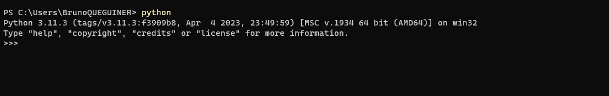

# Starting the application

To start the application, go to the directory **app** `cd app` Then execute the command `streamlit run app.py`
If you want to write the logs in a log file, execute the command `streamlit run app.py --logger.level=info 2>> logs/snowflake_summit.log`
Possible log levels are error, warning, info and debug.

# Starting the app with Docker

* Download, install and start [Docker](https://docs.docker.com/get-docker/)
* Go to the root directory of the project **snow** where the **Dockerfile** is located
* Build the docker image: `docker build -t snowflake_summit_image .`
* Start the container: `docker run -d --name snowflake_summit_container snowflake_summit_image`

# Configuration

The project contains two configuration files : **config.ini** and **.streamlit/config.toml**


# Installation guide for Windows

## Clone the project

You can get the necessary files using Git [(installation link)](https://git-scm.com/downloads) with command lines.

```
cd /path/to/my/project/directory
git clone https://gitlab.com/bqueguin/snowflake-summit.git
```

## DB


## Python 3.11.3

1. Download Python 3.11.4 installer by clicking [ici](https://www.python.org/ftp/python/3.11.3/python-3.11.3-amd64.exe).
2. Launch the installer and do the installation.
3. Test the installation opening a command prompt and execute the command `python`. You must access to the Python console. If it's not the case, check that the directory containing the executable python.exe have been correctly added to the Windows PATH environment variable.

   

4. Create your virtual Python environment

   A virtual environment is a directory containing a stand-alone installation of Python (independent of the operating system). It is especially convenient for all developers to use the same versions of Python packages. The **requirements.txt** file is used to list the packages required for the project as well as their versions used.
   
   ```
   cd /path/to/my/project
   python -m venv snowflake_summit_venv 
   cd ./snowflake_summit_venv/Scripts
   ./activate
   cd ../..
   pip install --upgrade pip
   pip install -r requirements.txt
   ```

   To stop using the **snowflake_summit_venv** virtual environment, execute the `deactivate` command.

5. Start the app

   ```
   cd app
   streamlit run app.py
   ```

